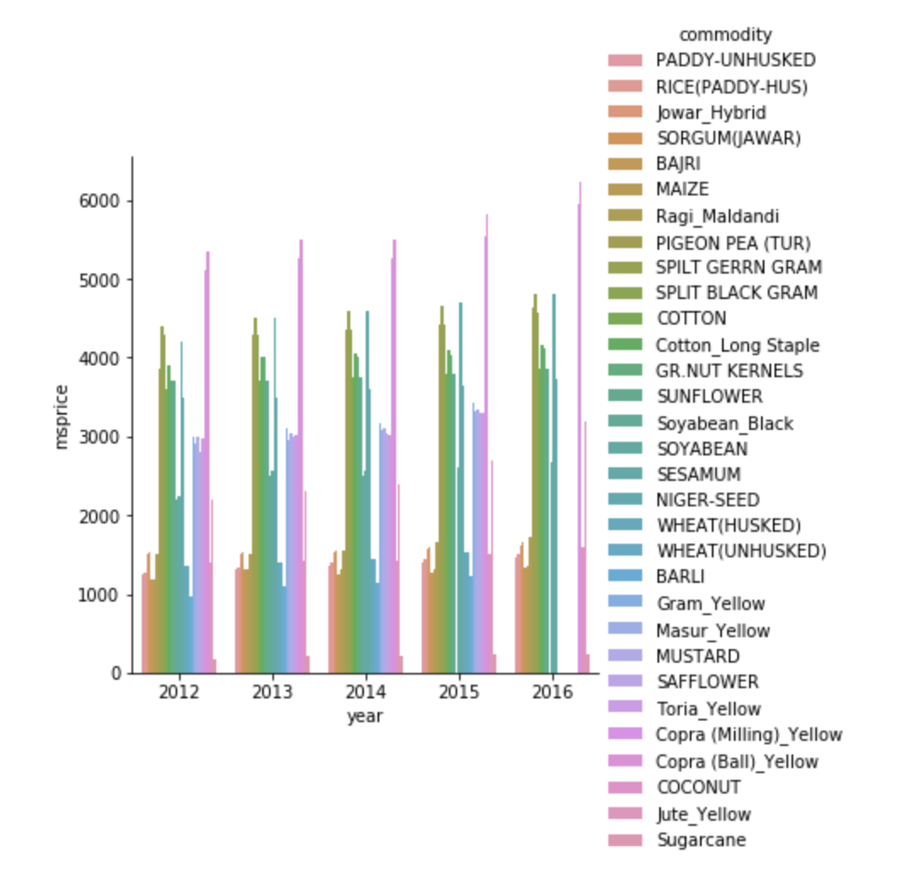
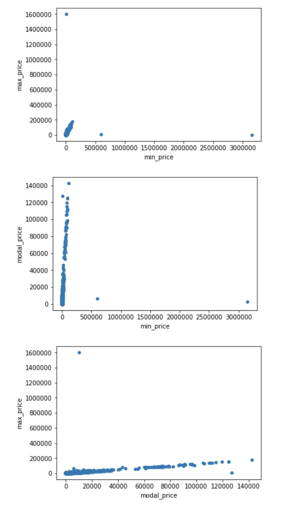
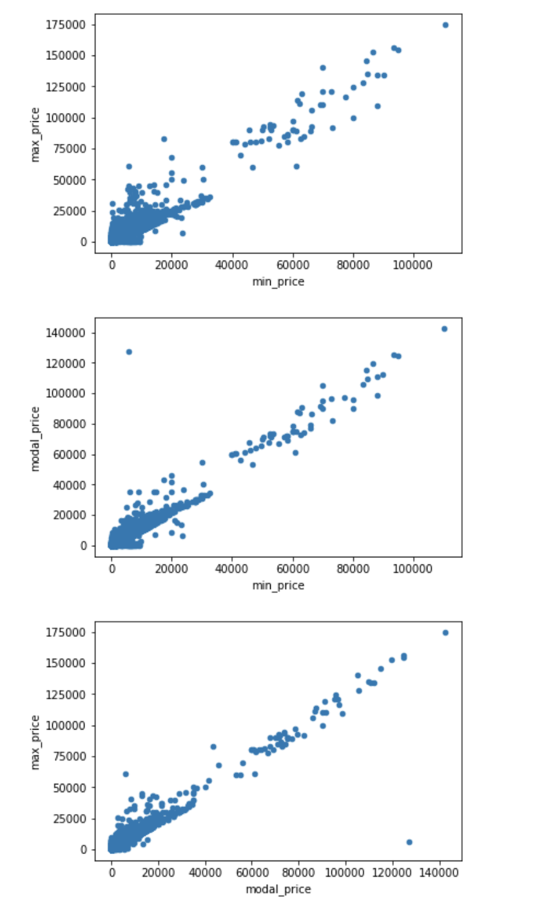
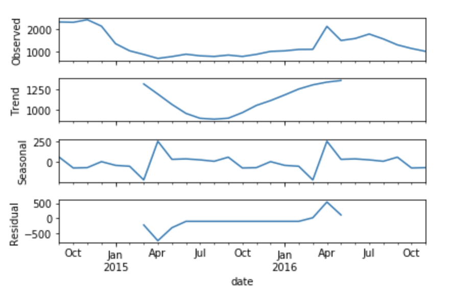
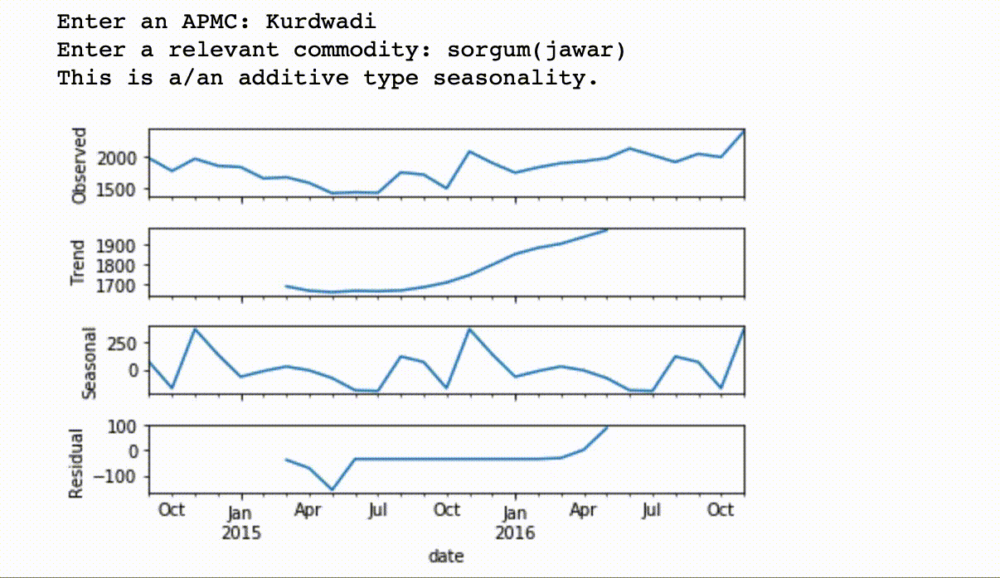
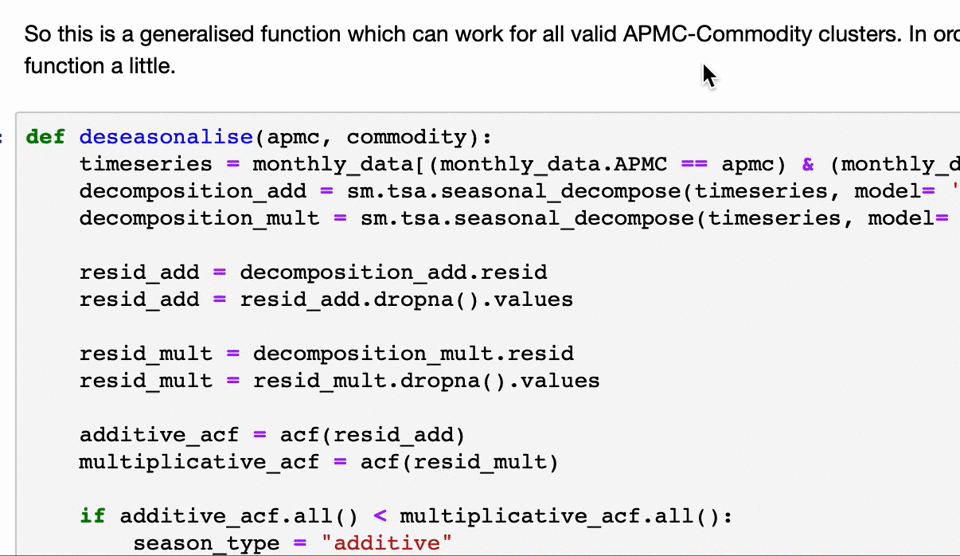
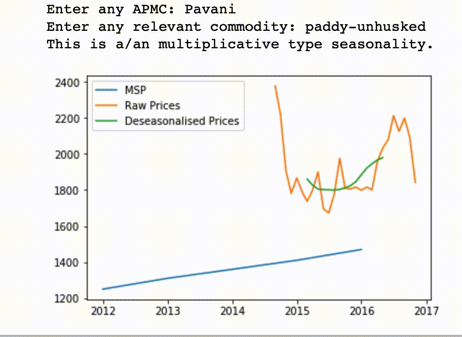
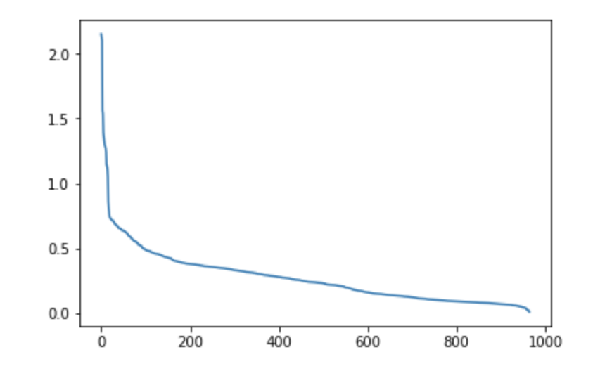
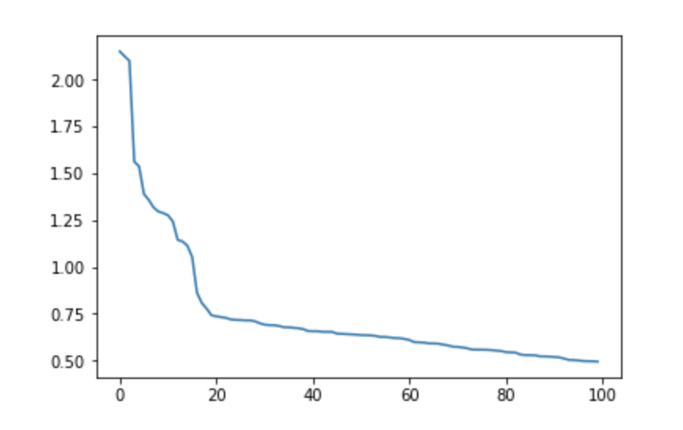
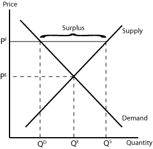

# Agriculture-Commodities-Price-and-Seasons

Minimum Support Price or MSP refers to the minimum price at which a commodity can be sold legally. The MSP is set by the government for various commodities annually. Agricultural Produce Market Committees or APMCs are the different marketing boards established by the government. A farmer sells his/her produce via auction at the mandi established by the APMC. Retailers cannot directly buy produce from the farmers. This prevents exploitation of the farmer.

Here, APMCs in Maharashtra are being looked at. Commodities are brought into the mandis and auctioned, however the price should legally be above the MSP.

## Aim:
1. Test and filter outliers.
2. Understand price fluctuations accounting the seasonal effect
    
    -Detect seasonality type (multiplicative or additive) for each cluster of APMC and commodities
    
    -De-seasonalise prices for each commodity and APMC according to the detected seasonality type
3. Compare prices in APMC/Mandi with MSP(Minimum Support Price)- raw and deseasonalised
4. Flag set of APMC/mandis and commodities with highest price fluctuation across different commodities in each relevant season, and year.

## Data Files:

All the data files are in `.csv` format.
* `CMO_MSP_Mandi.csv`: Raw data containing the MSPs of different commodities set up by the government in different years.
* `Monthly_data_cmo.csv`: Raw data containing the minimum, maximum and modal prices, and the quantity supplied in quintals, of commodities at various mandis for each month.

## Approach Methodology and Documentation:

### Exploration and Finding Outliers
* The code for the first task: [Task One](https://github.com/itsmepiyush2/Agriculture-Commodities-Price-and-Seasons/blob/master/exploration%20and%20outlier%20detection.ipynb)

The MSP varies greatly from commodity to commodity as can be seen from this bar plot.

#### "An outlier is an observation which deviates so much from the other observations as to arouse suspicions that it was generated by a different mechanism."
While carrying out outlier detection, one must be very careful and meticulous in order not to remove any useful information. Thus, it is important to keep in mind that a univariate outlier might not be a multivariate or regression outlier and vice versa. Thus, simply plotting boxplots and removing data values that seem to have an abnormal behaviour might chop off some useful information. Hence, I'll follow a very rudimentary approach to detect outliers.
The basic idea is the intuition that minimum, maximum and modal prices, throughout time, should follow similar patterns. Thus, they should be directly proportional to each other. In other words, they should have a positive correlation.

From the scatterplots, it is evident that there are three data points that do not conform to the general behaviour, two with minimum price > 500000 and one with maximum price > 1400000. Once these data points are removed, the scatterplots are as shown.

Now even after cleaning the data, there is one particular point that shows some abnormal behaviour. But, it's scale is almost negligible compared to the previous outliers. Moreover, there could be some other reason of it showing that specific behaviour which might not be decipherable right now. So removing it might as well be more dangerous.

We know that MSPs are decided by government policy. So the MSP dataset is simply a policy jotted down in a tabular form. There is no experiment so there are no observations in actuality. We are treating the data values in MSP dataset as ground truths. So attempting to detect outliers in the MSP dataset would seem absurd.

### Seasonality Detection, Seasonality Removal and Comparing Prices
* The code for the second and third tasks: [Tasks Two and Three](https://github.com/itsmepiyush2/Agriculture-Commodities-Price-and-Seasons/blob/master/seasonality%20detection%2C%20deseasonalising%20and%20comparing%20prices.ipynb)

#### "Any predictable change or pattern in a time series that recurs or repeats over a specific period can be said to be seasonal."
In order to detect seasonality in a time series, the signal needs to be broken down into trend, seasonality and the residue. In case of an additive seasonality, the signal is the summation of trend, seasonality and residue; and in case of multiplicative seasonality, the signal is the product of the three components.

The function `identify_seasonality` takes in two inputs, `APMC` and `Commodity`, and displays the type of seasonality that is present in the signal for the corresponding APMC and Commodity. It also decomposes the signal into its 3 components and plots them. Two use cases are given below in the form of a gif.
(The gifs are little slower than the actual running code.)

* Detecting additive seasonality

* Detecting multiplicative seasonality

The function `deseasonalise` acts in a similar way except that it only returns the original and the deseasonalised signals. It acts as a helping function for another function `compare_prices` which takes in the inputs `APMC` and `Commodity` and compares the MSP, raw prices and de-seasonalised prices for the corresponding APMC and Commodity. A use case is given below.

### Flagging the Set of APMC-Commodity Clusters that have High Price Fluctuation:
* The code for the fourth task: [Task Four](https://github.com/itsmepiyush2/Agriculture-Commodities-Price-and-Seasons/blob/master/fluctuations.ipynb)

The basic idea here is to first collect all the sets of APMCs and Commodities that have more than a year's worth of data. Then finding how far the data values are spread out by finding the coefficient of variation. (Coefficient of variation is simply the ratio of standard deviation and mean) Then sort the APMC-Commodity clusters in decreasing order of coefficient of variation and choose the top few clusters which have the highest coefficients of variation.

After sorting the clusters in descending order of coefficients of variation, it is plotted.

Logically, only those clusters need to be selected which lie to the left of the elbow formation since these have high coefficients of variation. However, it is difficult to pin-point exactly where the elbow is being formed. Let's zoom in.

It is evident that the clusters having indices less than or equal to 20 need to be selected.

Now, if we consider Gaussian (Normal) distribution, we know that ~99.7% of the entire data lies within 3 standard deviations of the mean on both sides. So if in case, a data point crosses 3 standard deviations, then the cluster has high price fluctuation. Using this intuition, the values of modal price that cross 3 standard deviations are recorded.

### Conclusion:

A Minimum Support Price (MSP) is an example of price floors that are set by the government to prevent them from falling further. It is the minimum price in which a commodity can be sold. But setting of price floors have other effects on individual demand and supply. If a price floor is set above the equilibrium price, then it reduces the demand for the commodity but there is an increase in its supply.

In other words, the producers produce more but the consumers are reluctant to buy at that price point. Thus, it creates a surplus of the commodity.
The government takes the burden of buying the excess surplus, which is only fair because it is the government that intervenes in the naturally facilitated demand and supply forces. However, in doing so, the government has to bear the burden of buying at a higher price and selling at a lower price.
In some other cases, the government introduces production quotas; these increase the prices while the producer is incentivised to produce less. This saves the government from bearing the loss and supply and demand stay at equilibrium.
